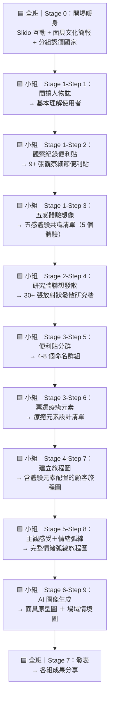

# 參與式設計工作坊規劃：面具 × XR 沉浸式異國體驗設計

本規劃透過將服務設計方法（如人物誌、研究牆、旅程地圖、身體風暴等）帶入「面具 × XR 沉浸式異國體驗」的情境中，以參與式設計工作坊的方式，幫助研究生有系統地將「面具的文化載體意涵」與「XR 沉浸療癒空間的服務時間軸」完美結合。

面具不僅是遮蔽面容的物件，更是一面映照人類文明的鏡子——從義大利威尼斯模糊階級的華麗面具，到非洲部落溝通神靈的儀式面具，再到日本能劇中神靈與傳統藝術的化身。透過 XR 技術與面具結合，為渴望出國卻礙於現實無法成行的使用者，設計一段從「踏入空間」到「帶走記憶」的完整沉浸式療癒體驗旅程。

---

## 一、工作坊基本資料

| 項目    | 內容                                                   |
| ----- | ---------------------------------------------------- |
| 工作坊名稱 | 面具 × XR 沉浸式異國體驗設計                                    |
| 主題    | 以服務設計流程，從人物誌出發，設計一段戴上面具（XR 載體）即可沉浸體驗異國風情的療癒空間        |
| 總時長   | 150 分鐘（2.5 小時）                                       |
| 參與人數  | 約 9 人（3 組，每組 3 人）                                    |
| 場地需求  | 每組一個 Miro/Canva 數位白板、投影設備、各組桌面空間（可貼便利貼）、Slido 即時互動工具 |

---

## 二、雙鑽石模型四階段實施指南

| 階段 | 工作坊實施步驟 | 建議使用方法 | 具體執行內容（面具 × XR 異國體驗版） | 體驗空間規劃 | 服務流程設計 | 現場應準備的工具 | 預期產出 |
|------|--------------|------------|-------------------------------|------------|------------|----------------|---------|
| 1. 探索需求（Discover） | 步驟 1：人物誌閱讀與脈絡觀察——引導參與者透過預先準備的人物誌資料，深入理解渴望出國卻無法成行之使用者的生活情境、潛在動機與痛點。 | 人物誌閱讀（Persona Reading）、觀察紀錄便利貼（Observation Notes）、脈絡訪談（Contextual Interview） | 每組領取一份對應特定國家/文化（日本、威尼斯、非洲）的虛構人物誌資料。組員先安靜閱讀 3 分鐘吸收人物的日常作息、生活環境、人際互動、關鍵物件與特質。接著每人獨立撰寫至少 3 張觀察便利貼，格式為「觀察到的具體細節 → 可能代表的含義」。例如：「她的房間貼了京都嵐山的海報 → 可能特別嚮往嵐山的竹林和安靜感」。全部貼到白板的觀察區後，組員快速口頭分享各自觀察。 | 盤點使用者對空間的潛在需求：從人物誌的生活環境細節（如窗外高架橋噪音、小套房的侷限感）推敲出使用者對療癒空間的渴望，例如開闊感、自然光、安靜。 | 盤點使用者目前的紓壓行為流程：觀察使用者現有的放鬆方式（如看旅遊 vlog、聽音樂逃離通勤噪音），找出行為中的情緒轉換關鍵節點與未被滿足的體驗缺口。 | 人物誌資料 3 份（每組 1 份，含人物圖像）、Canva/Miro 白板（預設觀察區）、便利貼（每組至少 20 張）、簽字筆。 | 每組至少 9 張「觀察細節→含義」便利貼、對人物誌使用者的深度理解共識。 |
| 1. 探索需求（Discover） | 步驟 2：五感體驗想像與研究牆建立——以人物誌觀察為基礎進行五感發散，再透過放射狀自由聯想建立與目標國家深度連結的研究牆。 | 五感體驗想像（Sensory Experience Mapping）、研究牆（Research Wall）、主題群集（Affinity Clustering） | 白板預設五個感官區域（👁 視覺、👂 聽覺、👃 嗅覺、✋ 觸覺、👅 味覺），每人各在每個感官下寫便利貼，小組以投票或口頭討論選出最有共識的 5 個體驗（每感官各 1 個）。接著以國家為核心、五感共識為第一層，進行放射狀聯想發散：從每張共識便利貼往外延伸關聯詞彙、元素、畫面或情境，持續往第二層、第三層拓展，目標每組至少 30 張以上便利貼。 | 感官空間元素盤點：將空間資料分為「視覺（光影、色彩、建築）」、「聽覺（自然音、儀式音）」、「嗅覺（香料、植物）」、「觸覺（材質、溫度）」、「味覺（當地飲食）」進行歸納，建立沉浸空間的感官設計素材庫。 | 體驗觸點聯想：從使用者的日常行為延伸，聯想出在 XR 沉浸空間中可能觸發情緒共鳴的感官接觸點，例如「御守→手作體驗→觸覺記憶」、「通勤 AirPods→環境音→聽覺療癒」。 | 白板（預設五感區域 + 研究牆區域）、便利貼（每組至少 60 張）、簽字筆、各文化面具參考圖（每組 3-5 張）。 | 每組一份五感體驗共識清單（5 個體驗）、每組一張以「國家」為核心的放射狀發散研究牆（至少 30 張便利貼）。 |
| 2. 定義問題（Define） | 步驟 1：便利貼分群與療癒元素票選——將研究牆上大量發散的素材進行分群收斂，透過投票機制篩選出最有設計潛力的療癒體驗元素。 | 親和圖分群（Affinity Clustering）、點選投票（Dot Voting）、洞見開發（Developing Key Insights） | 將研究牆便利貼全部複製到「分群區」，三人共同討論進行分群（意思相近的放在一起），每群不超過 8 張，超過代表分類太籠統需再細分。每群貼上命名便利貼（群組標題）。前 5 分鐘可嘗試「靜默分群」讓結果更直覺，後 10 分鐘再討論調整。完成後每人 5 票，投給最有設計潛力、最能呼應使用者需求的項目，得票 ≥ 1 的項目列入「療癒元素設計清單」。 | 空間主題定義：從分群結果中歸納出 XR 沉浸空間的核心主題調性（如「靜謐自然空間」、「儀式感場域」、「文化記憶角落」），作為空間設計的主軸方向。 | 流程設計方向定義：從票選結果識別出使用者最在意的體驗環節，確立體驗旅程中的核心觸發點，例如「入戲準備的身分轉換儀式感」或「出戲緩衝的情感延續」。 | 分群區白板空間、命名用便利貼、投票貼紙（每人 5 票）或數位白板投票功能、簽字筆。 | 4-8 個命名群組、一份票選後的「療癒元素設計清單」（後續旅程設計的核心素材）。 |
| 2. 定義問題（Define） | 步驟 2：「我們該如何……？」問題框架——將篩選出的療癒元素與使用者痛點轉化為具體的設計挑戰問句（HMW），引導團隊進入解決方案空間。 | 「我們可以如何？」問句（How Might We）、任務待辦（Jobs-to-be-done） | 基於人物誌的痛點與療癒元素清單，運用 HMW 框架將限制與需求轉化為設計挑戰。例如：「我們可以如何讓使用者在戴上面具的瞬間，就感覺自己身處京都的竹林小徑？」、「我們可以如何讓出戲的過程不是突然被拉回現實，而是被溫柔地送回來？」將 HMW 問題分群並融入旅程圖的各階段設計中。 | 空間痛點轉化：將「現實空間的侷限感」轉化為 XR 沉浸空間的設計挑戰，例如：「我們可以如何在小空間中透過 XR 營造出嵐山竹林的無邊際開闊感？」 | 流程斷點轉化：將使用者在現有紓壓行為中的斷點轉化為服務流程的設計機會，例如：「我們可以如何讓使用者從日常焦慮狀態，在 5 分鐘的入戲準備中完成心理轉換？」 | HMW 洞察模板、便利貼、簽字筆、前期完成的人物誌與療癒元素清單。 | 優先排序的 HMW 設計挑戰清單，作為旅程圖設計的指引方向。 |
| 3. 產品方案（Develop） | 步驟 1：顧客旅程圖建構與體驗元素置入——以票選出的療癒元素清單為素材，設計一張完整的 XR 沉浸式異國體驗顧客旅程圖。 | 顧客旅程圖共創（Co-creating Journey Maps）、腳本撰寫（Writing User Stories）、桌上演練（Desktop Walkthrough） | 在旅程圖模板上設定五個階段：「進入前（到達空間外）」→「入戲準備（走進空間）」→「XR 沉浸體驗」→「出戲緩衝」→「離開（帶走紀念）」。小組討論將療癒元素分配到各階段，明確標示使用者行為/動作、空間設計重點、體驗元素及具體呈現方式。分工：A 負責「進入前」+「入戲準備」；B 負責「XR 沉浸體驗」；C 負責「出戲緩衝」+「離開」。各自先填再合併討論補強。 | 體驗空間分區規劃：發想不同空間分區概念（如：文化過渡區、XR 沉浸主場域、休憩回歸區），並規劃面具展示區、XR 設備穿戴區、場域香氛與音場的佈建位置。 | 服務互動腳本設計：設計各節點的互動腳本（如：入場時遞上文化意象布巾、XR 體驗中面具感應連動環境變化、出戲時提供溫飲與紀念物件的儀式感安排）。 | 旅程圖模板（含五階段欄位，A3 紙本或 Canva/Miro 白板）、療癒元素設計清單、便利貼、簽字筆。 | 每組一張填寫完整的顧客旅程圖（含體驗元素配置與呈現方式）。 |
| 3. 產品方案（Develop） | 步驟 2：主觀感受與情緒弧線深化——以使用者視角撰寫主觀體驗感受，標註各階段情緒狀態，形成完整的情緒弧線設計。 | 情緒旅程地圖（Emotional Journey Mapping）、自我民族誌（Autoethnography）、調查式排練（Investigative Rehearsal） | 在旅程圖下方增加「使用者主觀感受（第一人稱書寫）」與「情緒標記」兩列。每人負責 1-2 個旅程階段，以第一人稱寫出使用者的內心想法（如：「換上和服腰帶布的瞬間感覺好像換了一個身分，那個香味……有點像三年前在京都……」）。用 emoji 標記情緒狀態（😟焦慮→😐平靜→😌放鬆→😊喜悅→🥹感動），並畫出從進門到離開的情緒弧線折線圖。三人串接確認情緒弧線流暢性。 | 空間情緒節點設計：定義空間中的「情緒高潮點」與「情緒過渡區」，例如 XR 沉浸區設計為情緒高峰（🥹沉浸感動），出戲緩衝區設計為溫暖回歸（😊平靜溫暖）。 | 情緒轉換時序設計：設定沉浸體驗的戲劇弧線（Dramatic Arc），確保情緒不是單調上升，而是有「期待→驚奇→沉浸→不捨→溫暖」的完整起伏節奏。 | 情緒標記模板（emoji 或文字）、旅程圖（Stage 4 完成版）、大張紙（繪製情緒弧線折線圖）、簽字筆。 | 含主觀感受 + 情緒弧線的完整顧客旅程圖。 |
| 4. 解決方案（Deliver） | 步驟 1：AI 生成面具與場域原型——用 AI 圖像生成工具快速視覺化「面具外型設計」與「場域情境氛圍」，將設計從文字走向可見的視覺原型。 | 低傳真原型測試（Lo-fi Prototyping）、AI 輔助概念視覺化（AI-assisted Concept Visualization） | 三人分工：A 根據旅程的文化主題撰寫面具外型的 AI 提示詞（含文化背景、材質、色調、設計特徵、氛圍）並生成面具原型圖；B 根據 XR 沉浸體驗的場景描述撰寫場域情境的 AI 提示詞（含空間類型、文化元素、燈光氛圍、地板材質、整體氛圍）並生成場域氛圍圖；C 整理旅程圖重點並準備 2 分鐘的發表內容。生成後快速檢視，如不滿意，調整關鍵詞重新生成（最多 2 次），各選出最滿意的一張。 | 面具空間載體設計：將面具定位為進入 XR 沉浸空間的「入口裝置」，透過 AI 原型圖確認面具的文化意象是否與空間情境協調一致。 | 場域服務原型驗證：透過 AI 生成的場域圖檢視服務流程中各觸點的空間氛圍是否連貫，確認「進入前→入戲→沉浸→出戲→離開」的視覺敘事是否流暢。 | AI 圖像生成工具（ChatGPT / Midjourney / Nanobanana2，每組至少 1 個帳號）、提示詞模板（面具 + 場域各 1 份，投影或列印）、各文化面具參考圖、手機/電腦。 | 每組 1 張 AI 生成的面具原型圖 + 1 張 AI 生成的場域情境圖。 |
| 4. 解決方案（Deliver） | 步驟 2：成果發表與全班共評——各組分享完整設計成果，展示三種不同文化的體驗設計如何呼應各自的人物誌需求。 | 成果發表（Presentation）、紅綠回饋（Red and Green Feedback） | 每組上台展示顧客旅程圖、面具原型圖、場域情境圖。發表結構：（1）「我們的使用者是___，他最渴望的是___。」（15 秒）；（2）「我們設計的體驗旅程是這樣的——進來時___，XR 裡面看到/感受到___，離開時帶走___。」（1 分 30 秒）；（3）展示面具與場域原型圖並說明設計想法（1 分鐘）。每組 3 分鐘，講師嚴格控時。最後由講師進行 1 分鐘收尾總結。 | 空間設計跨組對照：透過三組不同文化（日本、威尼斯、非洲）的發表，對比不同文化意象在沉浸空間中的呈現差異，激發跨文化空間設計的靈感。 | 服務流程跨組回饋：讓各組觀察其他組的旅程設計，給予「綠色回饋」（有效的體驗設計）與「紅色回饋」（可能破壞沉浸感的環節），進行跨組學習與優化。 | 投影設備、各組完成的旅程圖與 AI 原型圖、計時器。 | 各組完整成果展示、跨組回饋紀錄、講師總結。 |
| 跨階段跟進 | 全階段總結：繪製面具 × XR 異國體驗服務藍圖——連結前台文化沉浸體驗與後台 XR 技術支援系統。 | 服務藍圖（Service Blueprint） | 詳細對應客戶行動與後台支援。將「實體空間證物（如面具展示、文化裝置佈景）」、「前台人員行動（如遞上文化布巾、引導穿戴 XR 面具、遞送溫飲）」與「後台支援（如 XR 內容切換、環境感測器連動、音場控制系統操作）」視覺化對齊，確保前台體驗與後台技術緊密連結。 | 空間觸點可視化：在藍圖的「實體證物」層清晰標示使用者在每個階段接觸到的空間元素（文化佈景、燈光、氣味、材質、XR 畫面）。 | 前後台聯動機制：明確定義「互動線」與「可見線」，確保前台引導人員的口令與後台 XR 系統（場景切換、音效變化、光線調整）精準連動。 | 大型壁報紙、便利貼、簽字筆、整理過的研究與測試成果數據。 | 面具 × XR 沉浸式異國體驗服務藍圖、XR 軟硬體技術與營運人員協作職掌。 |

---

## 三、流程總覽

| 階段 | 時間        | 時長     | 互動類型       | 活動名稱                                | 雙鑽石階段  | 核心產出                        |
| ---- | ----------- | -------- | -------------- | --------------------------------------- | ---------- | ------------------------------- |
| 0    | 0:00–0:15   | 15 min   | 🟦 **全班**    | 開場暖身 + 簡報導入（Slido 互動）         | —          | 氛圍建立、題目理解、分組與國家認領 |
| 1    | 0:15–0:35   | 20 min   | 🟨 **小組**    | 人物誌閱讀 + 觀察便利貼 + 五感體驗想像     | Discover   | 觀察便利貼、每組 5 個感官體驗共識  |
| 2    | 0:35–0:55   | 20 min   | 🟨 **小組**    | 研究牆：聯想發散                          | Discover   | 每組一張以「國家」為核心的發散研究牆 |
| 3    | 0:55–1:20   | 25 min   | 🟨 **小組**    | 分群 + 票選療癒元素                       | Define     | 每組分群完成、票選出療癒元素設計清單 |
| 4    | 1:20–1:50   | 30 min   | 🟨 **小組**    | 顧客旅程（一）：HMW + 體驗元素置入旅程     | Develop    | 每組一張含體驗元素的顧客旅程圖     |
| 5    | 1:50–2:15   | 25 min   | 🟨 **小組**    | 顧客旅程（二）：主觀感受與情緒弧線         | Develop    | 完整情緒弧線旅程圖                |
| 6    | 2:15–2:25   | 10 min   | 🟨 **小組**    | 原型製作：AI 生成面具 + 場域圖像           | Deliver    | AI 面具原型圖 + 場域情境圖各 1 張  |
| 7    | 2:25–2:35   | 10 min   | 🟦 **全班**    | 發表                                    | —          | 各組成果分享                      |

---

## 四、各步驟的產出銜接

---

## 五、事先準備材料清單

| 項目                          | 數量               | 說明                                            | 備註                                  |
| ----------------------------- | ------------------ | ----------------------------------------------- | ------------------------------------- |
| 人物誌資料                    | 3 份（每組 1 份）   | 含生活描述 + 帶環境細節的人物圖像                  | 可製作成 Canva 白板卡片或列印 A4 紙本    |
| Canva / Miro 白板             | 3 個（每組 1 個）   | 預設觀察區、五感區、研究牆區、旅程圖模板等區域       | 課前測試連結可用性                       |
| 旅程圖模板                    | 3 份（每組 1 份）   | 含旅程階段欄、主觀感受欄、情緒標記欄                | 可嵌入 Canva 白板或列印 A3               |
| Slido 互動頁面                | 1 個               | Stage 0 開場互動用                                | 課前設好題目並測試                       |
| AI 圖像生成工具               | 每組至少 1 個帳號   | ChatGPT / Nanobanana2 / Midjourney               | 確認帳號有足夠次數，備好替代工具           |
| 提示詞模板（面具 + 場域）      | 1 份（投影或列印）  | 含 2-3 組範例提示詞供參考                          | 課前自己先試跑一次                       |
| 各文化面具參考圖               | 每組 3-5 張        | 日本能劇、威尼斯嘉年華、西非部落面具參考圖           | 可放在白板上或投影                       |
| 便利貼                        | 大量（每組至少 60 張）| 觀察用、五感用、研究牆用、分群用                    | 若用數位白板則用平台內的便利貼功能         |
| 投票貼紙 / 數位投票            | 每人 5 票          | Stage 3 票選療癒元素用                             | 數位白板可用表情符號或貼圖替代             |
| 投影設備                      | 1 套               | 簡報 + 提示詞模板 + 範例圖                         |                                       |
| 手機/電腦                     | 每組至少 1 台       | 開啟 Canva/Miro + AI 圖像生成                      |                                       |

---

## 六、時間風險與備案

| 可能超時的環節                  | 處理方式                                                                                        |
| ------------------------------ | ----------------------------------------------------------------------------------------------- |
| 研究牆聯想（Stage 2）           | 如果某組過了 12 分鐘還在貼第二層，直接喊停進入分群，便利貼數量不夠也沒關係。                         |
| 分群討論（Stage 3）             | 如果組員在分群上爭論太久，講師直接走過去幫忙建議：「這幾張放一起，叫做___，你們同意嗎？」繼續推進。   |
| 旅程圖填寫（Stage 4）           | 如果某組花太多時間在 XR 技術可行性討論，講師介入：「先寫理想版本，可不可行之後再說。」               |
| AI 圖像生成（Stage 6）          | 如果生成速度太慢，改為「展示寫好的提示詞 + 口頭描述圖像」，圖片課後生成補交。                       |
| 發表超時（Stage 7）             | 嚴格控時，每組 3 分鐘到就切換，不追加。如果時間真的不夠，省略情緒弧線說明，直接展示圖。               |
